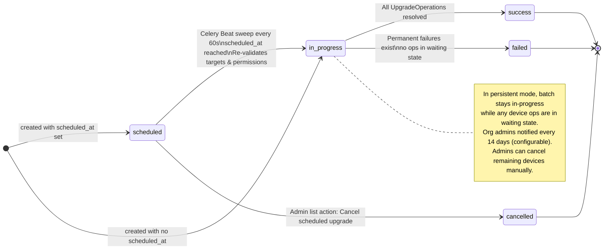
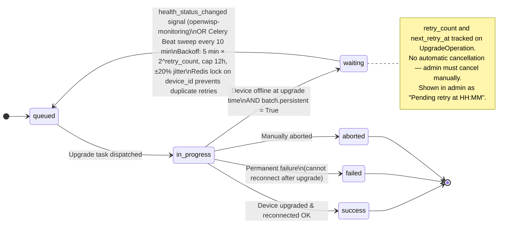
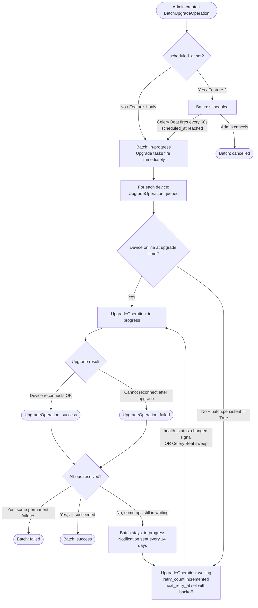

# GSoC 2026 — Persistent & Scheduled Firmware Upgrades
**OpenWISP Firmware Upgrader · Status State Machines · Aditya Shandilya**

> **New statuses introduced by this project:**
> - `waiting` *(NEW)* on `UpgradeOperation` — device was offline at upgrade time, persistent retry pending
> - `scheduled` *(NEW)* and `cancelled` *(NEW)* on `BatchUpgradeOperation`
>
> All other statuses (`queued`, `in-progress`, `success`, `failed`, `aborted`) are existing.
> The `waiting` badge label is pending UX review by the OpenWISP team (per [GSoC Discussion: Persistent & Scheduled Upgrades Clarifications #1249](https://github.com/openwisp/openwisp-firmware-upgrader/discussions/1249)).

---

## 1. BatchUpgradeOperation — Lifecycle State Machine

---

## 2. UpgradeOperation — Per-Device Lifecycle State Machine

---

## 3. Combined End-to-End Flow (Features 1 + 2)

---

**References:**
- [[feature] Persistent mass upgrades #379](https://github.com/openwisp/openwisp-firmware-upgrader/issues/379)
- [[feature] Scheduled mass upgrades #380](https://github.com/openwisp/openwisp-firmware-upgrader/issues/380)
- [Prototype PR: GSoC 2026 Prototype — Persistent & Scheduled Firmware Upgrades #1](https://github.com/Adityashandilya555/openwisp-firmware-upgrader/pull/1)
